# cheese-quizz

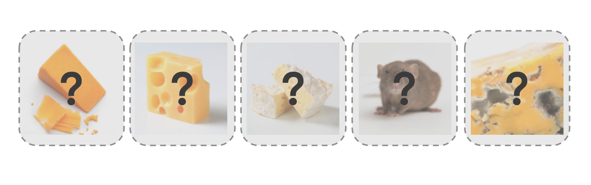

A fun cheese quizz deployed on OpenShift and illustrating cloud native technologies like Quarkus, Istio Service Mesh, CodeReady Workspaces, Strimzi Kafka Operator, Fuse Online/Syndesis, Tekton pipelines and ArgoCD.

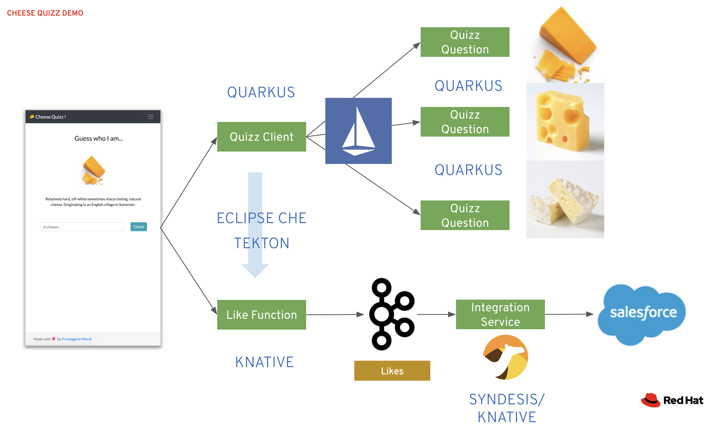

* **Part 1** Try to guess the displayed cheese! Introducing new cheese questions with Canaray Release and making everything resilient and observable using Istio Service Mesh. Deploy supersonic components made in Quarkus,

* **Part 2** Implement a new "Like Cheese" feature in a breeze using CodeReady Workspaces, demonstrate the inner loop development experience and then deploy everything using Tekton.

* **Part 3** Add the "Like Cheese API" using Serverless Knative and make it push new messages to Kafka broker. Use Syndesis or CamelK to deploy new integration services and create lead into Salesforce CRM ;-) 

## Start here for viewing the code

[](https://codeready-workspaces.apps.cluster-lemans-0014.lemans-0014.example.opentlc.com/f?url=https://github.com/lbroudoux/cheese-quizz)

## Cluster Setup

Please initialize and configure following operators in this order:

> All the components below can be setup using my `cluster-init.sh` script that you may find [here](https://github.com/lbroudoux/openshift-cases/tree/master/cluster-init/ocp-4.4).

* Istio Service Mesh deployed with `basic-install` on `istio-system` project
  * Take care of removing `LimitRanges` into `cheese-quizz` project

* Knative Serving deployed cluster wide
  * Create a `KnativeServing` CR into `knative-serving` project, adding `image-registry.openshift-image-registry.svc:5000` into `registriesSkippingTagResolving` property

* Fuse Online operator deployed into `fuse-online` project
  * Create a `SyndesisCRD` CR, calling it `syndesis`

* AMQ Streams operator deployed cluster wide,

* OpenShift Pipelines deployed cluster wide,

* CodeReady Workspaces operator deployed onto `workspaces` project with:
  * `quay.io/lbroudoux/che-plugin-registry:master` as the `pluginRegistryImage`
  * `true` for `tlsSupport`
  * `CHE_INFRA_KUBERNETES_PVC_WAIT__BOUND: 'false'` as `server.customCheProperties`

This is what the `CheCluster` custom resource shoud look like: 

```yml
apiVersion: org.eclipse.che/v1
kind: CheCluster
metadata:
  name: codeready-workspaces
  namespace: workspaces
spec:
  server:
    cheImageTag: ''
    cheFlavor: codeready
    devfileRegistryImage: ''
    pluginRegistryImage: 'quay.io/lbroudoux/che-plugin-registry:master'
    tlsSupport: true
    selfSignedCert: false
    customCheProperties:
      CHE_INFRA_KUBERNETES_PVC_WAIT__BOUND: 'false'
  database:
    externalDb: false
    chePostgresHostName: ''
    chePostgresPort: ''
    chePostgresUser: ''
    chePostgresPassword: ''
    chePostgresDb: ''
  auth:
    openShiftoAuth: true
    identityProviderImage: ''
    externalIdentityProvider: false
    identityProviderURL: ''
    identityProviderRealm: ''
    identityProviderClientId: ''
  storage:
    pvcStrategy: per-workspace
    pvcClaimSize: 1Gi
    preCreateSubPaths: true
```

## Demo setup

We need to setup the following resources for our demonstration:

* A `cheese-quizz` project for holding your project component
  * Make this project part of the Service Mesh control plane installed into `istio-system` by deploying a `ServiceMeshMemberRoll` into `istio-system` referencing `cheese-quizz` project as member

  * Once done, ensure `cheese-quizz` project has the following labels to be sure it is included into Service Mesh: 
    * `istio.io/member-of=istio-system`
    * `kiali.io/member-of=istio-system`

* A `cheese-quizz-function` project for holding the serverless part and the Kafka broker

* A `Kafka` broker CR into `cheese-quizz-function` letting the default properties
  * `oc create -f manifest/kafka.yml -n cheese-quizz-function`
  * `oc create -f manifest/kafka-topic.yml -n cheese-quizz-function`

Start deploying the components needed at the beginning of this demo, we'll deploy the other ones later on.

```
oc create -f manifests/quizz-question-deployment-v1.yml -n cheese-quizz
oc create -f manifests/quizz-question-deployment-v2.yml -n cheese-quizz
oc create -f manifests/quizz-question-deployment-v3.yml -n cheese-quizz
oc create -f manifests/quizz-question-service.yml -n cheese-quizz
oc apply -f manifests/quizz-question-destinationrule.yml -n cheese-quizz
oc apply -f manifests/quizz-question-virtualservice-v1.yml -n cheese-quizz
oc create -f manifests/quizz-client-buildconfig.yml -n cheese-quizz
oc create -f manifests/quizz-client-deploymentconfig.yml -n cheese-quizz
oc create -f manifests/quizz-client-service.yml -n cheese-quizz
oc create -f manifests/quizz-client-route.yml -n cheese-quizz
oc rollout latest cheese-quizz-client -n cheese-quizz
```

## Demonstration scenario

Once above commands are issued and everything successfully deployed, retrieve the Cheese Quzz route:

```
$ oc get route/cheese-quizz-client -n cheese-quizz |grep cheese-quizz-client |awk '{print $2}' 
cheese-quizz-client-cheese-quizz.apps.cluster-lemans-0014.lemans-0014.example.opentlc.com
```

and open it into a browser. You shoul get the following:

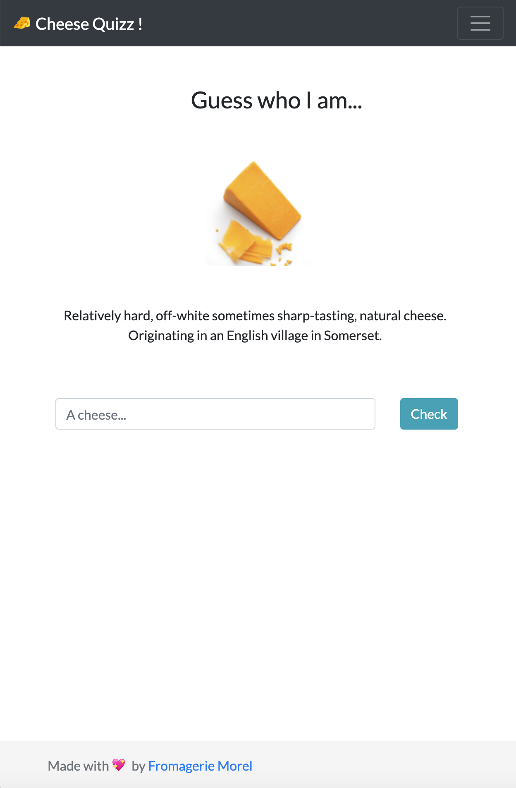

### OpenShift ServiceMesh demonstration

#### Canary release and blue-green deployment

Introduce new `v2` question using Canary Release and header-matching routing rules:

```
oc apply -f manifests/vs-cheese-quizz-question-virtualservice-v1-v2-canary.yml -n cheese-quizz
```

Using the hamburger menu on the GUI, you should be able to ubscribe the `Beta Program` and see the new Emmental question appear ;-) 

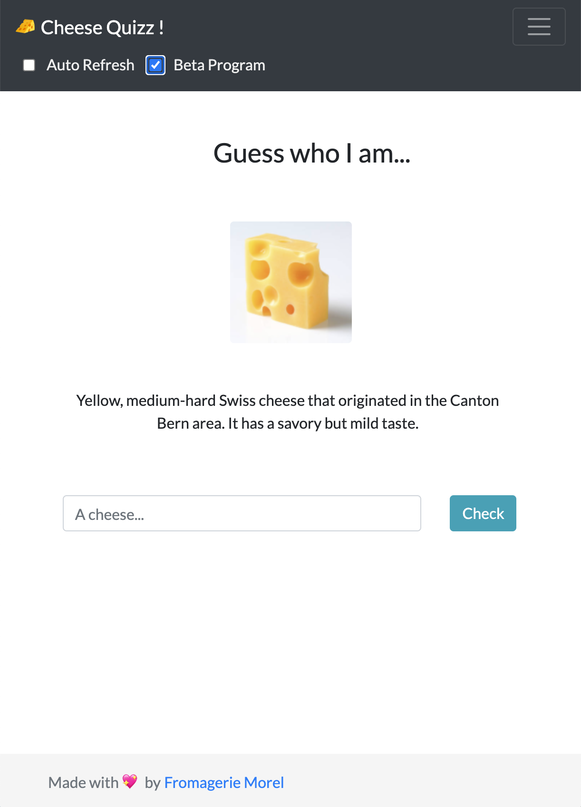

Now turning on the `Auto Refresh` feature, you should be able to visualize everything into Kiali, showing how turning on and off the Beta subscription has influence on the visualization of networks routes.

Once we're confident with the `v2` Emmental question, we can turn on Blue-Green deployment process using weighted routes on the Istio `VirtualService`. We apply a 70-30 repartition:

```
oc apply -f manifests/vs-cheese-quizz-question-virtualservice-v1-70-v2-30.yml -n cheese-quizz
```

Of course we can repeat the same kind of process and finally introduce our `v3` Camembert question into the game. Finally, we may choose to route evenly to all the different quizz questions, applying a even load-balancer rules on the `VirtualService`: 

```
oc apply -f manifests/vs-cheese-quizz-question-virtualservice-all.yml -n cheese-quizz
```

#### Circuit breaker and observability

Now let's check some network resiliency features of OpenShift Service Mesh.

Start by simulating some issues on the `v2` deployed Pod. For that, we can remote log to shell and invoke an embedded endpoint that will make the pod fail. Here is bellow the sequence of commands you'll need to adapt and run:

```
$ oc get pods -n cheese-quizz | grep v2
cheese-quizz-question-v2-847df79bd8-9c94t                        2/2     Running     0          5d19h
$ oc rsh cheese-quizz-question-v2-847df79bd8-9c94t
----------- TERMINAL MODE: --------------------
Defaulting container name to greeter-service.
Use 'oc describe pod/cheese-quizz-question-v2-847df79bd8-9c94t -n cheese-quizz' to see all of the containers in this pod.
sh-4.4$ curl localhost:8080/api/cheese/flag/misbehave
Following requests to / will return a 503
sh-4.4$ exit
exit
command terminated with exit code 130
```

Back to the browser window you should now have a little mouse displayed when application tries to reach the `v2` question of the quizz.

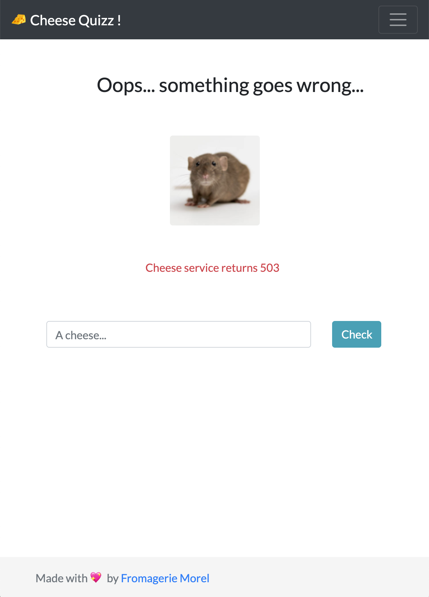

Using obervability features that comes with OpenShift Service Mesh like Kiali and Jaeger, you are now able to troubleshoot and check where the problem comes from (imagine that we already forgot we did introduce the error ;-))

Thus you can see the Pod causing troubles with Kiali graph:

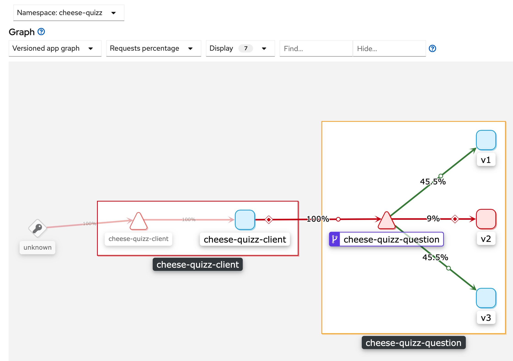

And inspect Jeager traces to see the details of an error:

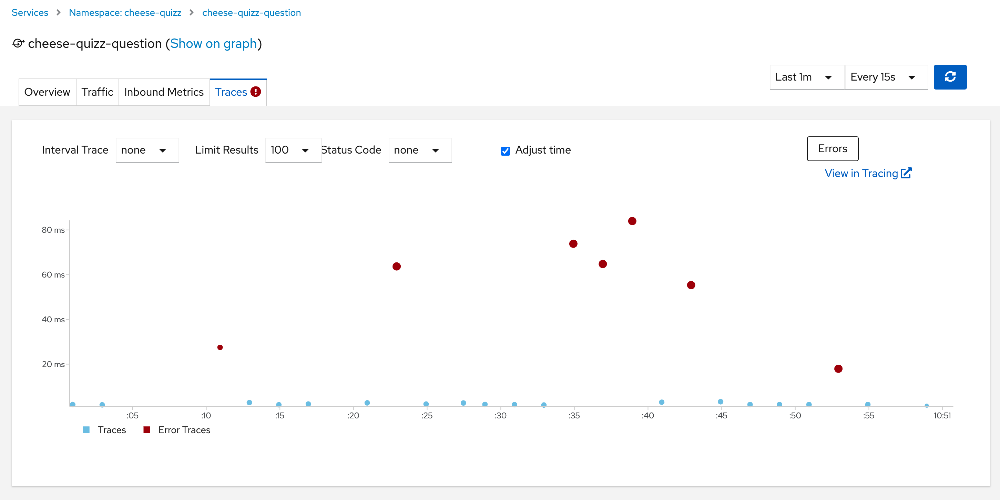

In order to make our application more resilient, we have to start by creating new replicas, so scale the `v2` deployment. 

```
oc scale deployment/cheese-quizz-question-v2 --replicas=2 -n cheese-quizz
```

Newly created pod will serve requests without error but we can see in the Kiali console that the service `cheese-quizz-question` remains degraded (despite green arrows joinining `v2` Pods).

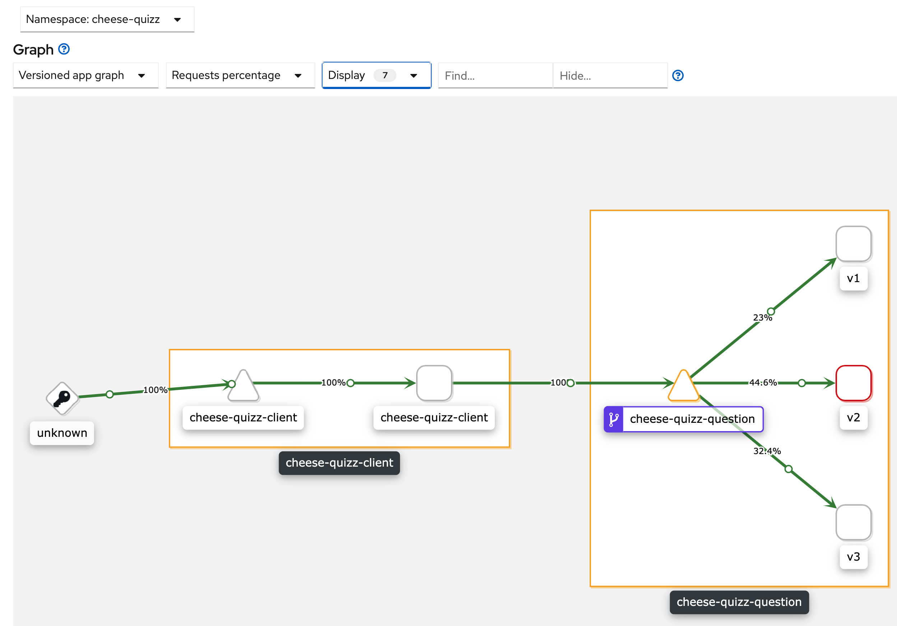

There's still some errors in distributed traces. You can inspect what's going on using Jaeger and may check that there's still some invocations going to the faulty `v2` pod.

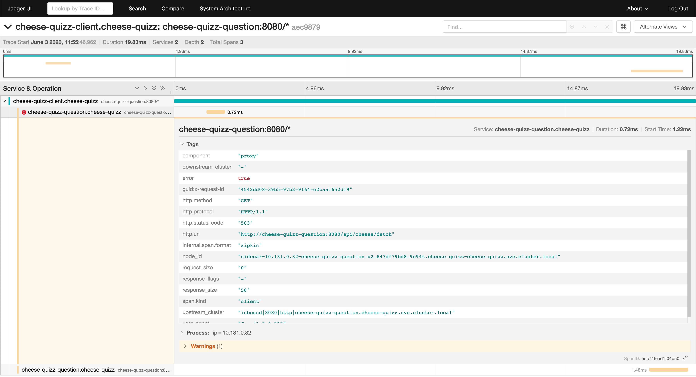

Istio proxies automatically retry doing the invocation to `v2` because a number of conditions are present:
* There's a second replica present,
* It's a HTTP `GET` request that is supposed to be idempotent (so replay is safe),
* We're in simple HTTP with no TLS so the headers inspectation allow determine these conditions.

An optimal way of managing this kind of issue would be to declare a `CircuitBreaker` for handling this problem more efficiently. Circuit breaker policy will be in charge to detect Pod return ing errors and evict them from the elligible targets pool for a configured time. Then, the endpoint will be re-tried and will re-join the pool if erverything is back to normal.

Let's apply the circuit breaker configuration to our question `DestinationRule`:

```
oc apply -f istiofiles/dr-cheese-quizz-question-cb -n cheese-quizz
```

Checking the traces once again in Kiali, you should no longer see any errors! 

#### Timeout/retries management

Pursuing with network resiliency features of OpenShift Service Mesh, let's check now how to handle timeouts.

Start by simulating some latencies on the `v3` deployed Pod. For that, we can remote log to shell and invoke an embedded endpoint that will make the pod slow. Here is bellow the sequence of commands you'll need to adapt and run:

````
$ oc get pods -n cheese-quizz | grep v3
cheese-quizz-question-v3-9cfcfb894-tjtln                         2/2     Running     0          6d1h
$ oc rsh cheese-quizz-question-v3-9cfcfb894-tjtln
----------- TERMINAL MODE: --------------------
Defaulting container name to greeter-service.
Use 'oc describe pod/cheese-quizz-question-v3-9cfcfb894-tjtln -n cheese-quizz' to see all of the containers in this pod.
sh-4.4$ curl localhost:8080/api/cheese/flag/timeout
Following requests to / will wait 3s
sh-4.4$ exit
exit
````

Back to the browser window you should now have some moistures displayed when application tries to reach the `v3` question of the quizz.

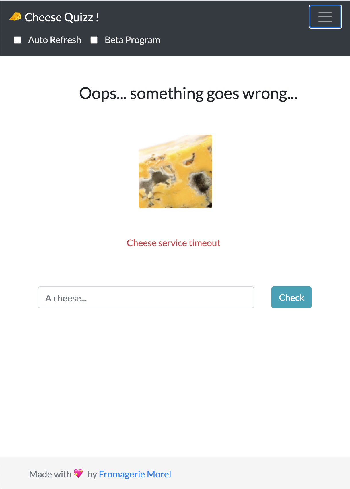

Before digging and solving this issue, let's review the application configuration :
* A 3 seconds timeout is configured within the Pod handling the `v3` question. Let see the [question source code](https://github.com/lbroudoux/cheese-quizz/blob/master/quizz-question/src/main/java/com/github/lbroudoux/cheese/CheeseResource.java#L110)
* A 1.5 seconds timeout is configured within the Pod handling the client. Let see the [client configuration](https://github.com/lbroudoux/cheese-quizz/blob/master/quizz-client/src/main/resources/application.properties#L14)

Checking the distributed traces within Kiali console we can actually see that the request takes 1.5 seconds before returning an error:

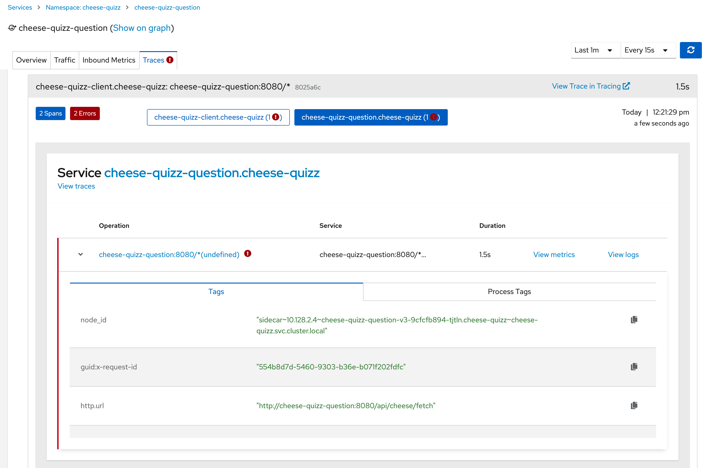

In order to make our application more resilient, we have to start by creating new replicas, so scale the `v3` deployment.

```
oc scale deployment/cheese-quizz-question-v3 --replicas=2 -n cheese-quizz
```

Newly created pod will serve requests without timeout but we can see in the Kiali console that the service `cheese-quizz-question` remains degraded (despite green arrows joinining `v3` Pods).

However there's still some errors in distributed traces. You can inspect what's going on using Jaeger and may check that there's still some invocations going to the slow `v3` pod.

The `CircuitBreaker` policy applied previsouly does not do anything here because the issue is not an application problem that can be detected by Istio proxy. The result of a timed out invocation remains uncertain, but we know that in our case - an idempotent `GET` HTTP request - we can retry the invocation.

Let's apply for this a new `VirtualService` policy that will involve a retry on timeout.

```
oc apply -f istiofiles/vs-cheese-quizz-question-all-retry-timeout.yml -n cheese-quizz
```

Once applied, you should not see errors on the GUI anymore. When digging deep dive into the distributed traces offered by OpenShift Service Mesh, you may however see errors traces. Getting into the details, you see that detailed parameters of the `VirtualService` are applied: Istio do not wait longer than 100 ms before making another attempt and finally reaching a valid endpoint.

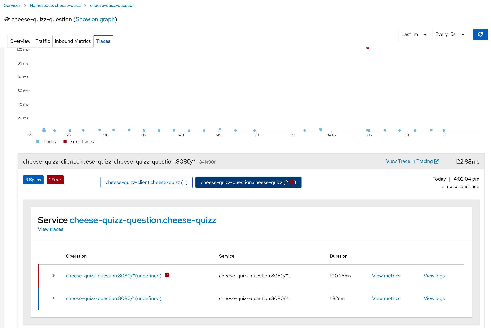

The Kiali console grap allow to check that - from a end user point of view - the service is available and green. We can see that time-to-time the HTTP throughput on `v3` may be reduced due to some failing attempts but we have now great SLA even if we've got one `v2` Pod failing and one `v3` Pod having response time issues:


#### Security with MTLS

Let's try applying Mutual TLS on our destinations:

```
oc apply -f istiofiles/dr-cheese-quizz-question-mtls -n cheese-quizz
```

### CodeReady Workspaces demonstration

This is the beginning of **Part 2** of the demonstration. After having installed CodeReady Workspaces as specified in **Cluster Setup**, start retrieving the route to access it:

```
oc get route/codeready -n workspaces | grep codeready | awk '{print $2}'
```

You can use this route to configure the `Developer Workspace` badge as I did it at the begining of this README file. Now clicking this badge in a new browser tab or window, you'll ask CodeReady Workspaces to create a new workspace for you.

> If it's the first time, you're connecting the service, you'll need to authenticate and approve the reuse of your profile information.

Worskspace creation waiting screen:

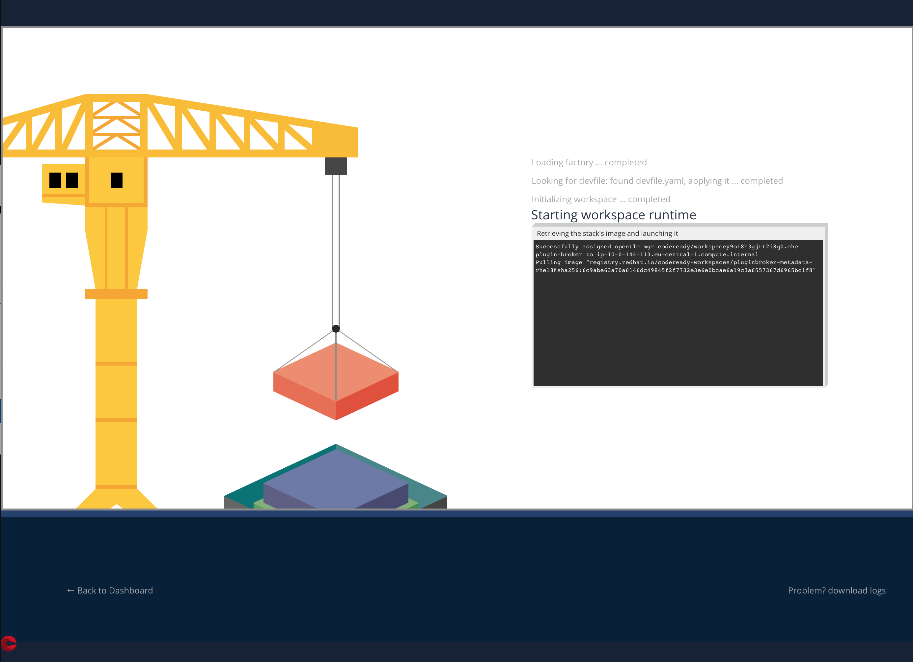

After some minutes, the workspace is initialized with the source files coming from a Git clone. You can spend time explaining the relationship between the `devfile.yaml` at the root of this repotisotory and the content of the wokspace.

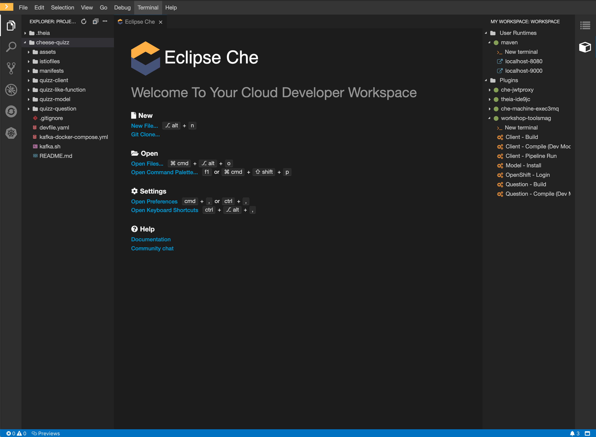

Now let's build and deploy some componentn in order to illustrate the development inner loop.

Using the scripts on the right hand panel, you will have to first locally install the `quizz-model` component with the **Model - Install** script. Here's the terminal results below:

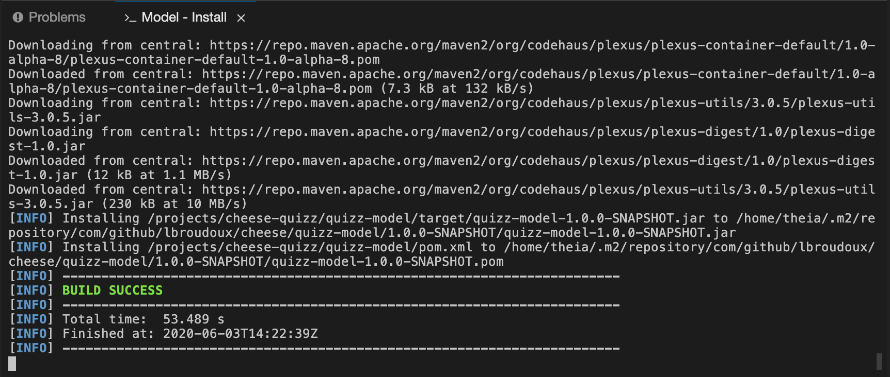

Then, you will be able to launch the `quizz-question` module in Quarkus development monde using the **Question - Compile (Dev Mode)** script. CRW asks if current process should be made available through an OpenShift Route for accessing the pod:

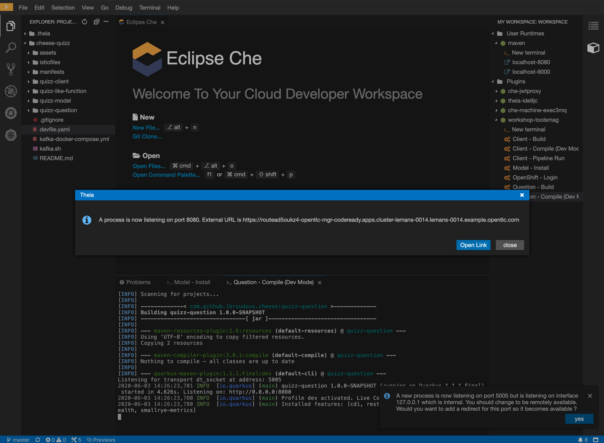

Finally, you can launch the `quizz-question` module using the **Client - Compile (Dev Mode)** script. Here you will have access to the GUI, running in CRW, when launching the preview:

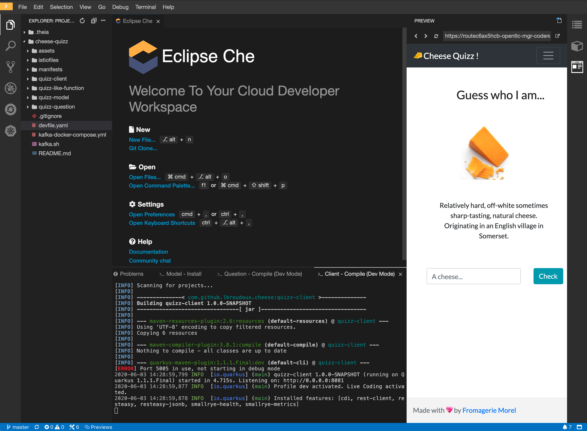

It's time to talk a little bit about Quarkus, demo hot reloading and explain how we're gonna implement the "Like Cheese" screen by modifying `src/main/resources/META-INF/index.html` and test it locally:

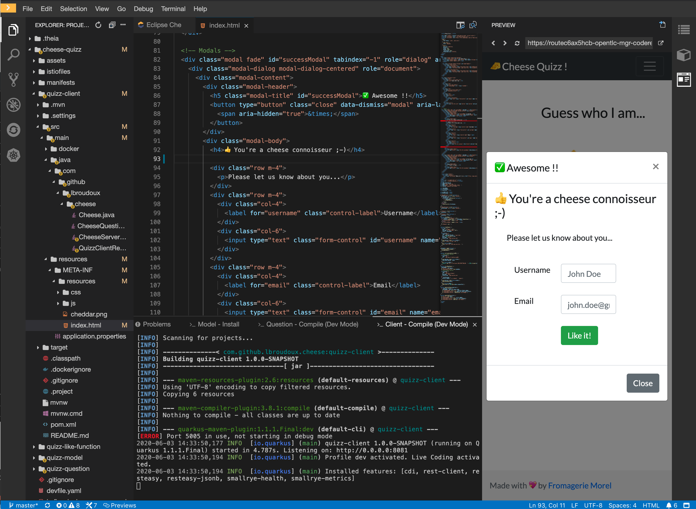

Before commiting our work, we'd like to talk a bit about how to transition to the outer-loop and trigger deployment pipeline.

### OpenShift Pipelines demonstration

Ensure the different custom resources for Tekton / OpenShift Pipelines are installed into the `cheese-quizz` project:

```
oc create -f manifests/oc-deploy-task.yml -n cheese-quizz
oc create -f manifests/oc-ensure-no-triggers.yml -n cheese-quizz
oc create -f manifests/oc-patch-deployment-task.yml -n cheese-quizz
oc create -f manifests/oc-start-build-task.yml -n cheese-quizz
oc create -f manifests/quizz-client-pipeline.yml -n cheese-quizz
oc create -f manifests/quizz-client-pipeline-trigger.yml -n cheese-quizz
oc create -f manifests/quizz-client-pipeline-listener.yml -n cheese-quizz
``` 

Configure a `Webhook` trigger on your Git repository holding the sources. First you have to retrieve the full URL of the Tekton `Trigger` that must be invoked:

```
oc get route/quizz-client-pipeline-listener -n cheese-quizz | grep quizz-client-pipeline-listener | awk '{print $2}'
```

Then follow your preferred Git repo documentation to set such a webhook. Here's an example below using GitHub on this repository: 

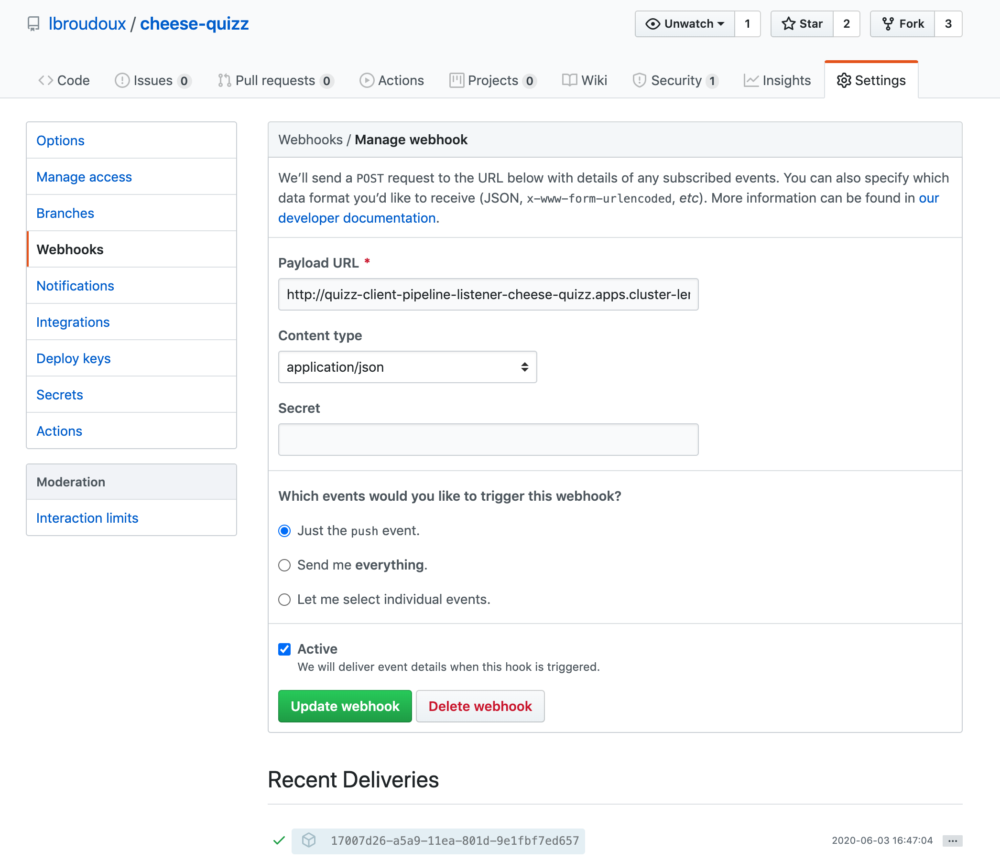

Now that this part is OK, you can finish your work into CodeReady Workspaces by commiting the changed file and pushing to your remote repository:

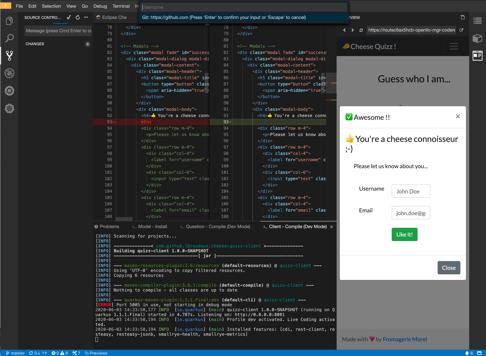

And this should simply trigger the Tekton / OpenShift Pipeline we just created !

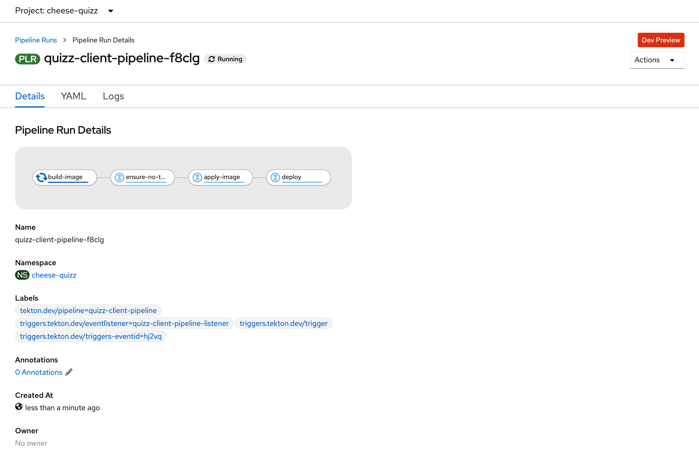

You can display the different task logs in OpenShift console:

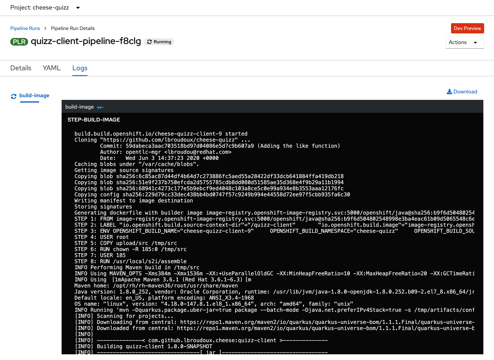

And finally ensure that our pipeline is successful.

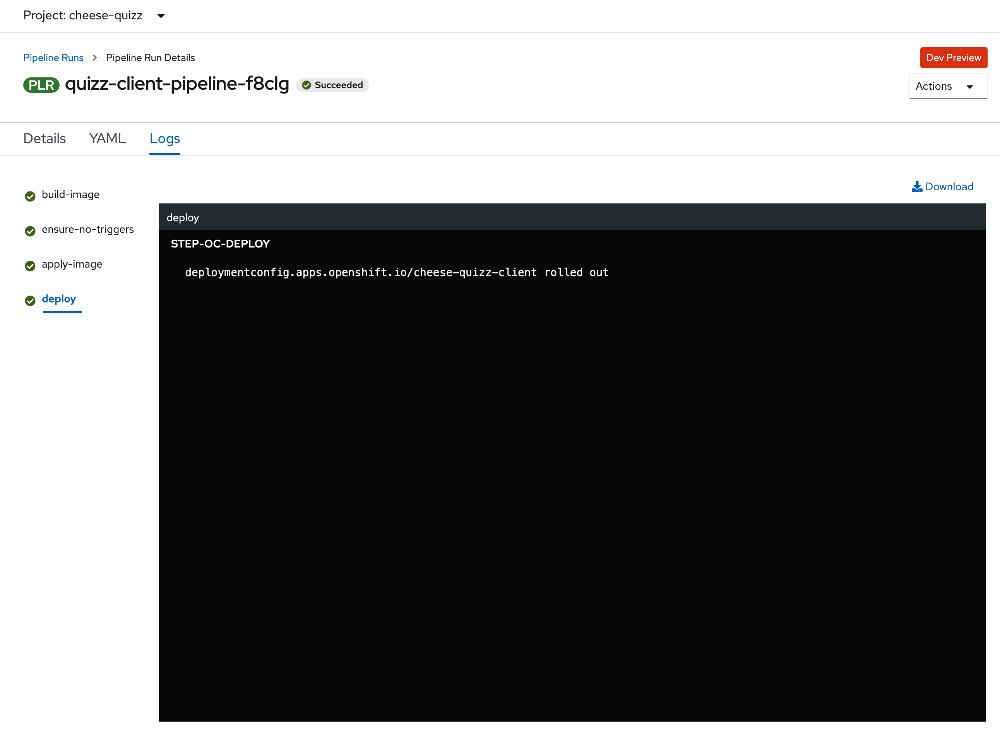

We can now also demonstrate the new fetaure deployed onto our OpenShift cluster.

### OpenShift Serverless demonstration

This is the beginning of **Part 3** of the demonstration. Now you're gonne link the "Like Cheese" feature with a message publication within a Kafka broker. So first, we have to deploy a broker and declare a topic we'll use to advert of new `CheeseLike` messages.

```
oc create -f manifests/kafka.yml -n cheese-quizz-function
oc create -f manifests/kafka-topic.yml -n cheese-quizz-function
```

Now just deploy our `quizz-like-function` module that is a NodeJS app into the `cheese-quizz-function` project using the Developer Console, adding a component from Git. Here's the capture of the long form:

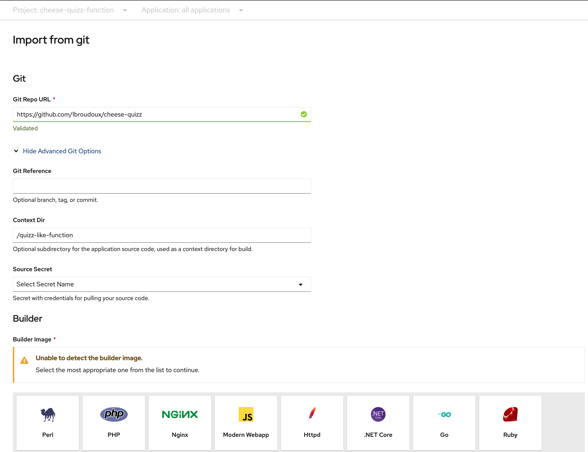

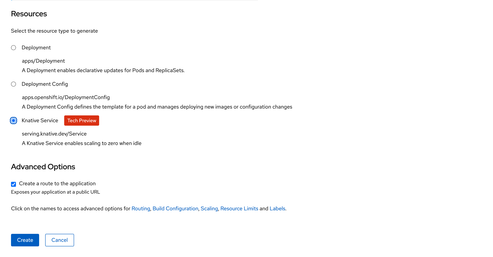

Because we use graphical wizard for creating our Knative Service, we do not have the opportunity to set environment variables. Our application should communicate with Kafka broker and also specified it is using a specific 4000 TCP port. You can do this using the `kn` command line tool:

```
kn service update cheese-quizz-like-function -p 4000 -e KAFKA_HOST=my-cluster-kafka-bootstrap.cheese-quizz-function.svc.cluster.local:9092
```

Still using the `kn` tool, we can now see that Knative has created for us 2 revisions. One being the one created at first after form validation, the pther resulting of the environment variable and port modification:

```
kn revision list -n cheese-quizz-function
NAME                                 SERVICE                      TRAFFIC   TAGS   GENERATION   AGE     CONDITIONS   READY   REASON
cheese-quizz-like-function-gfdjz-5   cheese-quizz-like-function                    2            6m52s   3 OK / 4     True    
cheese-quizz-like-function-khzw9     cheese-quizz-like-function                    1            37m     0 OK / 4     False   ExitCode1 : Container failed with: info using  ...
```

We see that first revision fails to start because of missing environment variable and that latest revision is now ready to receive traffic. We have now to ditribute traffic to this revision. This can be done from the Developer Console when accessing the service resources and hitting the **Set Traffic Distribution** on the right hand panel:

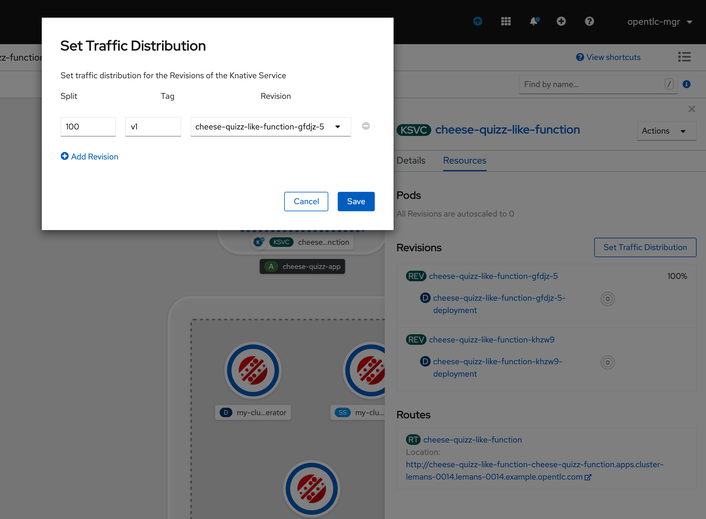

You'll see now that an arrow indicating that revision receives traffic appears on the Developer Console. Also we can check the traffic distribution using the CLI:

```
kn revision list -n cheese-quizz-function
NAME                                 SERVICE                      TRAFFIC   TAGS   GENERATION   AGE   CONDITIONS   READY   REASON
cheese-quizz-like-function-gfdjz-5   cheese-quizz-like-function   100%      v1     4            27m   3 OK / 4     True    
cheese-quizz-like-function-khzw9     cheese-quizz-like-function                    1            58m   0 OK / 4     False   ExitCode1 : Container failed with: info using  ...
```

> Note: we could have achieved the same result only using the CLI commands below:
```
kn service update cheese-quizz-like-function --tag v1=cheese-quizz-like-function-gfdjz-5
kn service update cheese-quizz-like-function --traffic v1=100
```

Now just demo how Pod are dynamically popped and drained when invocation occurs on function route. You may just click on the access link on the Developer Console or retrieve exposed URL from the command line:

```
kn service describe cheese-quizz-like-function -o yaml -n cheese-quizz-function | yq r - 'status.url'
```

Now that we also have this URL, we should update the `cheese-quizz-client-config` ConfigMap that should hold this value and serve it to our GUI.

```
$ oc edit cm/cheese-quizz-client-config -n cheese-quizz
----------- TERMINAL MODE: --------------------
# Please edit the object below. Lines beginning with a '#' will be ignored,
# and an empty file will abort the edit. If an error occurs while saving this file will be
# reopened with the relevant failures.
#
apiVersion: v1
data:
  application.properties: |-
    # Configuration file
    # key = value
    %kube.quizz-like-function.url=http://cheese-quizz-like-function-cheese-quizz-function.apps.cluster-lemans-0014.lemans-0014.example.opentlc.com
kind: ConfigMap
metadata:
  creationTimestamp: "2020-06-04T09:55:07Z"
  name: cheese-quizz-client-config
  namespace: cheese-quizz
  resourceVersion: "4656024"
  selfLink: /api/v1/namespaces/cheese-quizz/configmaps/cheese-quizz-client-config
  uid: 7a97745b-abc3-4b22-aaad-07b566fca3cb
~                                                                             
~                                                                           
~                                                                             
-- INSERT --
:wq
configmap/cheese-quizz-client-config edited
```

> Do not forget to delete the remaining `cheese-quizz-client` pod to ensure reloading of changed ConfigMap.

### Fuse Online demonstration

This is the final part where you'll reuse the events produced within Kafka broker in order to turn into business insights !

First thing first, create a Salesforce connector within your Syndesis/Fuse Online instance. This can be simply done using thet [guide](https://access.redhat.com/documentation/en-us/red_hat_fuse/7.6/html-single/connecting_fuse_online_to_applications_and_services/index#connecting-to-sf_connectors).

Then you'll have to create a connector to our Kafka instance located at `my-cluster-kafka-bootstrap.cheese-quizz-function.svc.cluster.local:9092`.

You should now have these 2 connectors ready to use and you can create a new integration, we'll call `cheese-quizz-likes to Salesforce'.

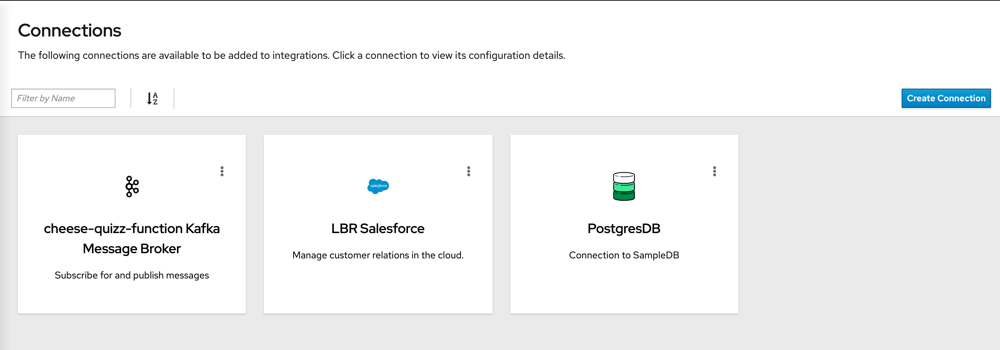

When creating a new integration, you shoud select the Kafka connector as a source, subscribing to the topic called `cheese-quizz-likes` and filling out this example `JSON Instance` :

```json
{
  "email": "john.doe@gmail.com",
  "username": "John Doe",
  "cheese": "Cheddar"
}
```

You will be asked to fill out some details about data type and description like below:

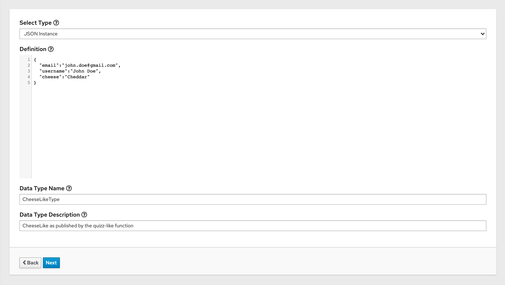

Just after that you'll have to select the Salesforce connector as the integration end, picking the **New Record** action and choosing the **Lead** data type. Finally, in the next screen, you'll have to add a `Data Mapper` intermediary step to allow transformation of the Kafka message data.

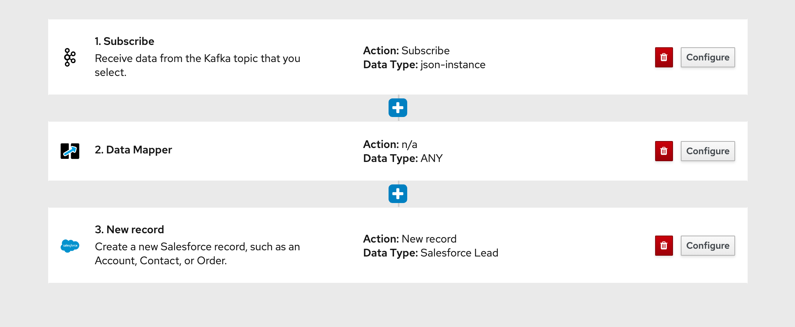

We'll realize a mapping between following fields:
* `username` will be split into `FirstName` and `LastName`,
* `email` will remain `email`,
* `cheese` will fedd the `Description` field

We'll add two extras constants on the left hand pane:
* `Quizz Player` will feed the `Company` field that is required on the Salesforce side,
* `cheese-quizz-app` will feed the `LeadSource`field.

You should have something like this:

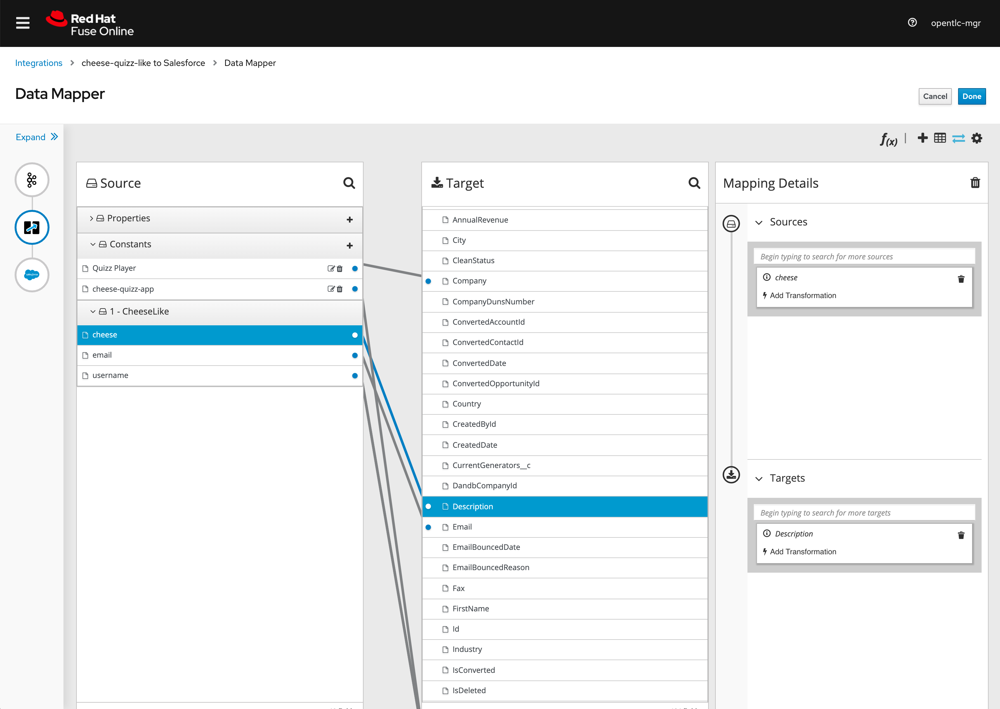

Hit the **Save and Publish** button and wait a minute or two that Syndesis built and publish the integration component. Once OK your should be able to fill out the connoisseur form on the app side and hit the **Like** button. Just see Knative popping out a new pod for processing the HTTP call and producing a message into the Kafka broker. Then the Syndesis integration route will take care of transformaing this message into a Slaesforce Lead.

The result should be something like this on the Slaesforce side:

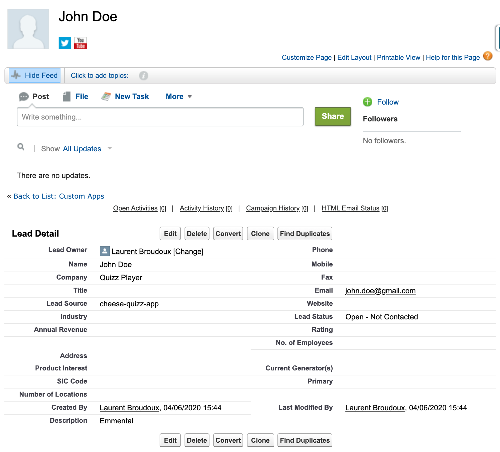

You can track activity of the integration route, looking at the **Activity** tab in the route details:

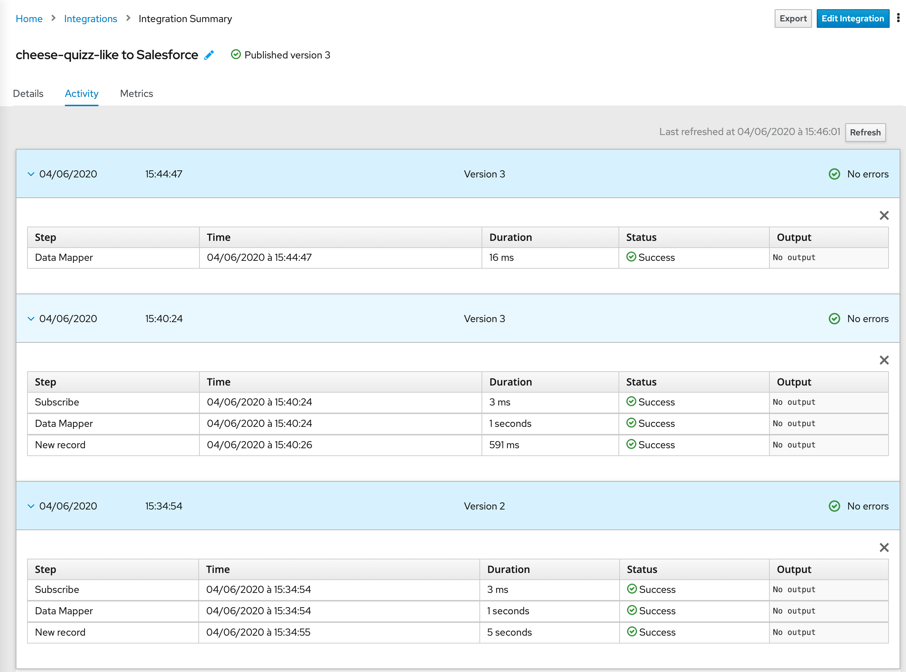

### ArgoCD bonus demonstration ;-)

```
oc -n argocd apply -f https://raw.githubusercontent.com/argoproj/argo-cd/v1.4.2/manifests/install.yaml
```