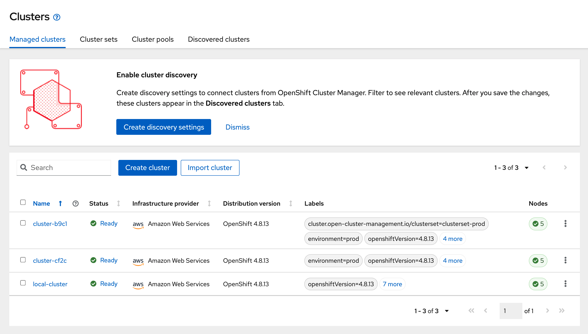
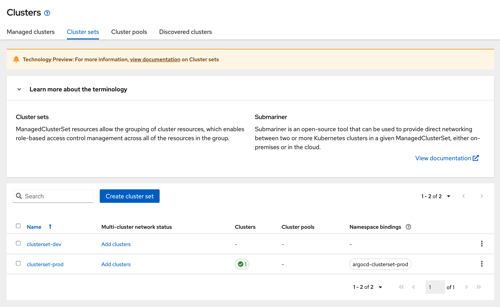
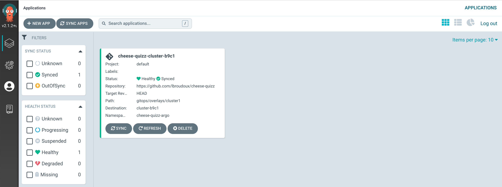
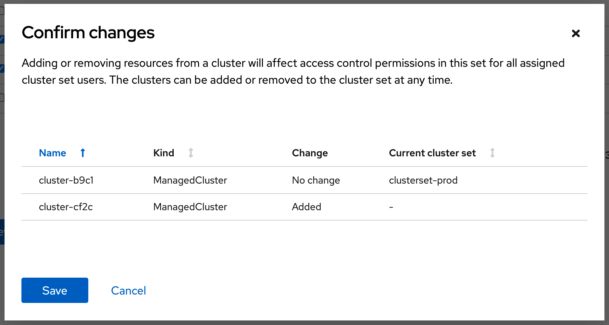
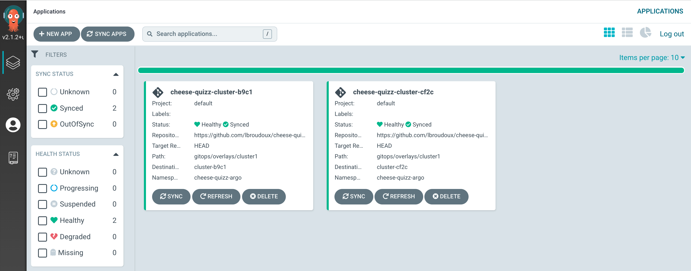
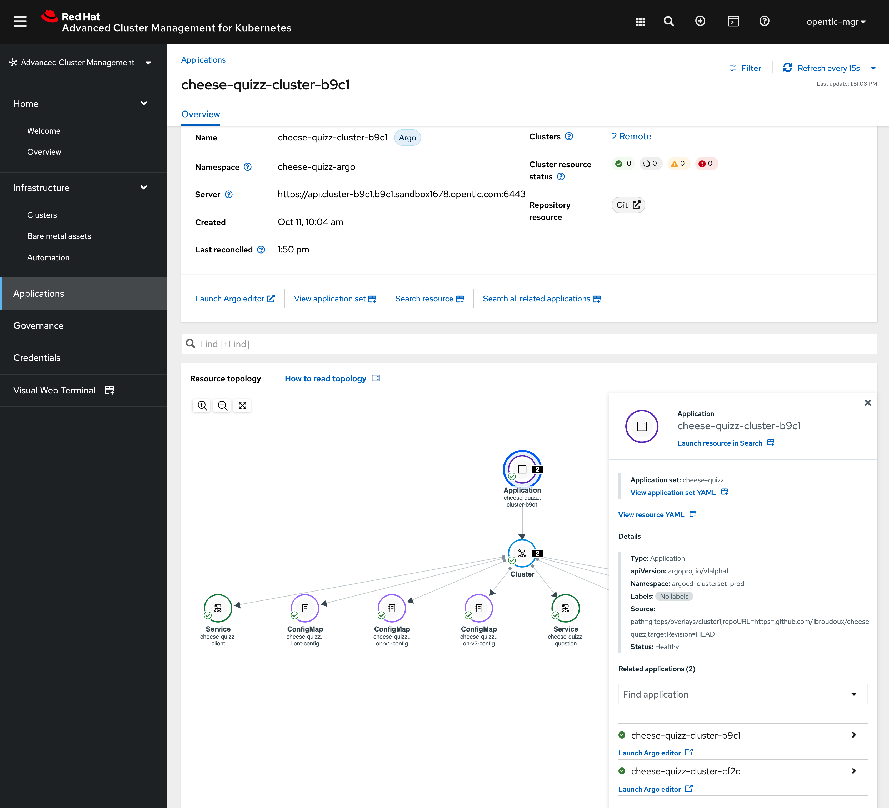

# Open Cluster Manager + ArgoCD

Will the release of [Red Hat Advanced Cluster Management 2.3](https://access.redhat.com/documentation/en-us/red_hat_advanced_cluster_management_for_kubernetes/2.3/), there's now a bridge between cluster management features into OCM and GitOps deployment using ArgoCD. Here are below the instructions to demonstrate them using the `cheese-quizz` application.

## Cluster setup

### ManagedClusterSet

`ManagedClusterSet` is a new custom resource in OCM that obviously allows to group managed cluster together within a set. For this demonstration, we'll create a set called `clusterset-prod`. This is a cluster wide resource so you can create it directly from the RHACM GUI or with:

```
oc apply -f clusterset-prod.yml
```

For this cluster set, we now have to define a `ManagedClusterSetBinding` that is a link between the cluster-wide resource and a specific Kubernetes namespace where all the specific resources related to this cluster set will resides. Because, it's an ArgoCD demo, we decide to create an `argocd-clusterset-prod` namespace and apply the binding within:

```
kubectl create ns argocd-clusterset-prod
oc apply -f clusterset-prod-binding.yml -n argocd-clusterset-prod
```

We also have to declare a `Placement` for this cluster set. Placement will provide and indirection between resources that want to address a cluster set without having hard reference to it. They'll refer to the `Placement`instead.

```
oc apply -f clusterset-prod-placement.yml -n argocd-clusterset-prod
```

### ArgoCD configuration

On the Hub cluster, you'll have to install the `OpenShift GitOps Operator`. This can be easily done through the embedded OperatorHub into OpenShift. You have to install the operator globally.

Once Operator is installed on the Hub cluster, create a new ArgoCD installation that will be located into the `argocd-clusterset-prod` project:

```
oc apply -f argocd-clusterset-prod.yml -n argocd-clusterset-prod
```

This ArgoCD installation will use the embedded OpenShift authentication mechanism so you'll may log into the GUI using your cluster username and password.

Now that your ArgoCD is up-and-running, you'll need a final touch to bridge your `ManagedClusterSet` with this ArgoCD instance. This should be done creating a `GitOpsCluster`. A `GitOpsCluster` link together a `ManagedClusterSet` resource and an `ArgoCD` resource thanks to the previously created `Placement`.

```
oc apply -f clusterset-prod-gitops-cluster.yml -n argocd-clusterset-prod
```

### Application configuration

Finally, let's deploy some application on top of ArgoCD! This is done through an `ApplicationSet` resource that defines a template for building Argo's `Application`. We'll define this resource using a [Cluster generator](https://argocd-applicationset.readthedocs.io/en/stable/Generators-Cluster/) that allows automatic discovery of cluster based on the presence of `Secrets` within the namespace. These secrets will be in fact produced by the `GitOpsCLuster` in synchronisation with the members of a watched `ManagedClusterSet`.

Just create the application set with:

```
oc apply -f cheese-quizz-applicationset.yml -n argocd-clusterset-prod
```

## Demonstration scenario

Let say, you start your demonstration with 3 clusters:
* `local-cluster` represents the ACM Hub cluster,
* `cluster-b9cf` and `cluster-cf2c` are 2 regular clusters that have been enrolled in the Hub.



You can access `ManagedClusterSet`s using a thumbnail in the UI. At beginning of your demonstration, you just have 1 member into `clusterset-prod` cluster set.



On the ArgoCD side, you should have just one application tile illustrating the synchronisation status of the Cheese-quizz app on the member cluster.



How does Argo know where to deploy this application? Has specified with the `ApplicationSet` specificaiton, it's looking for a cluster secret having a `apps.open-cluster-management.io/acm-cluster: "true"` label. You can check that such a secret exist with this command:

```yaml
$ oc get secret/cluster-b9c1-cluster-secret -o yaml
--- OUTPUT ----
apiVersion: v1
kind: Secret
metadata:
  creationTimestamp: "2021-10-11T08:04:32Z"
  labels:
    apps.open-cluster-management.io/acm-cluster: "true"
    apps.open-cluster-management.io/cluster-name: cluster-b9c1
    apps.open-cluster-management.io/cluster-server: api.cluster-b9c1.b9c1.sandbox1678.opentlc.com
    argocd.argoproj.io/secret-type: cluster
  name: cluster-b9c1-cluster-secret
  namespace: argocd-clusterset-prod
  resourceVersion: "1007211"
  uid: 9a93009c-613b-4237-a0db-0849e5035456
type: Opaque
data:
  config: ewogICJiZWFyZXJUb2tlbiI6ICJleUpoYkdjaU9pSlNVekkxTmlJc0ltdHBaQ0k2SW5acFJYSjVaSGRuTkdaUlVFUnFVM0ZyUkhjNVNsbFpNelZWYkZSVlZWQnBNbEJ5ZUZSaFYyRXphbXNpZlEuZXlKcGMzTWlPaUpyZFdKbGNtNWxkR1Z6TDNObGNuWnBZMlZoWTJOdmRXNTBJaXdpYTNWaVpYSnVaWFJsY3k1cGJ5OXpaWEoyYVdObFlXTmpiM1Z1ZEM5dVlXMWxjM0JoWTJVaU9pSnZjR1Z1TFdOc2RYTjBaWEl0YldGdVlXZGxiV1Z1ZEMxaFoyVnVkQzFoWkdSdmJpSXNJbXQxWW1WeWJtVjBaWE11YVc4dmMyVnlkbWxqWldGalkyOTFiblF2YzJWamNtVjBMbTVoYldVaU9pSnJiSFZ6ZEdWeWJHVjBMV0ZrWkc5dUxXRndjRzFuY2kxMGIydGxiaTF3T1dNNWJTSXNJbXQxWW1WeWJtVjBaWE11YVc4dmMyVnlkbWxqWldGalkyOTFiblF2YzJWeWRtbGpaUzFoWTJOdmRXNTBMbTVoYldVaU9pSnJiSFZ6ZEdWeWJHVjBMV0ZrWkc5dUxXRndjRzFuY2lJc0ltdDFZbVZ5Ym1WMFpYTXVhVzh2YzJWeWRtbGpaV0ZqWTI5MWJuUXZjMlZ5ZG1salpTMWhZMk52ZFc1MExuVnBaQ0k2SWpRNE1qVmlNR1EwTFRZM01EY3ROREk0WmkwNFlqZzNMVGRsT1RjM1pXVTRPVEE1TVNJc0luTjFZaUk2SW5ONWMzUmxiVHB6WlhKMmFXTmxZV05qYjNWdWREcHZjR1Z1TFdOc2RYTjBaWEl0YldGdVlXZGxiV1Z1ZEMxaFoyVnVkQzFoWkdSdmJqcHJiSFZ6ZEdWeWJHVjBMV0ZrWkc5dUxXRndjRzFuY2lKOS5saTBxUEVINUxZVTV1XzYyaGRtdk9zV2tpTDFwUVJpZnNHRE80VXlIQUhZUlFTNFFfWDltekN4U3MxanV2cGN6X2g5aGhKaHd5TzRGV0ZfQUJ0OWtNVXNnNTc2WWJOb3ZZeDdYNUNKNTZrcDNPVzEyQlpzcUxSTmc2Vk9Gai1mNzR0WnUwTEZILWZKUGR1WjJPd0VSdHc2TmVCRDRmTWVMUlhOSlpkOFFwYUlhUndHYm1JaHU0N19DRUFralM5VUlUUGs1d3pYcTVVU0RXOFFOOThITTJOUlVLNmpTZ180cXNUSEJPZFlHTk9wZHdnZFRXMFpicXRzSHp4TmVRZGs1dGFQRmJsa3RONHpnLTM3WDhGWnpmWVF0cExvRU95UEVtbldkMEg3MkdKUHFfNFl5WEFTa19jZ29kUF9sYkNjTjk1eGtTU09VX0xBUjRaTjEwc2tRU1NxZWlsVjVHTVNYT2F3ZUFyY1Ywd2Q1REYyUVF1T0pUNzE4ZGNUWEJxM0lwNUR2dnR2ZjVYdm5DUkx3VlVNbWN5aUV1czRPT01CeUNZWktjUl9Ud2ZyeDB6N2FWQXpLLUJWNlJtNGsyUHNYT3ViLXdOd1Zmd2QyOXp1NFNTdXVBS183N19ZNWdERENiZ3F2aXBGN3JFN1VWWEVCN2k0ZW5sVzNOdGRXd1g4UFE5aVdDU3pxcHlRYlFvMC1vMjFZTTFtU2Mwc1VvSE9IVk1NZ3ZyR1pmMXdqMlpzbnV3eGdmRmxRbWV4RC1UemxWTjRqb1RQWDU2ak13QkgyajVHTDdBRUJLVEZWWlR5cUdULV9JUUR6UUluTnFncmNCYS00cTVqajJPeDFuNkZtREFpV0RLbXI4LURiU2J2M1JIbUFMVE1maGE2Zm5fbE9FdkZVcVNSQ0lySSIsCiAgInRsc0NsaWVudENvbmZpZyI6IHsKICAgICJpbnNlY3VyZSI6IHRydWUKICB9Cn0=
  name: Y2x1c3Rlci1iOWMx
  server: aHR0cHM6Ly9hcGkuY2x1c3Rlci1iOWMxLmI5YzEuc2FuZGJveDE2Nzgub3BlbnRsYy5jb206NjQ0Mw==
```

You see that the `name` and `server` properties are used in the application set template to create new `Application`. `config` property is used for connecting the remote cluster.

Now, just add the remaining cluster as a new member of the `clusterset-prod`. ACM will display a review dialog before you confirm membership changes:



Just hist **Save** and issue following command to see changes in `argocd-clusterset-prod` namespace:

```
$ oc get secrets -n argocd-clusterset-prod | grep cluster-secret
--- OUTPUT ----
cluster-b9c1-cluster-secret                            Opaque                                3      1d3h
cluster-cf2c-cluster-secret                            Opaque                                3      4s
```

Within some seconds, the secret will be discovered by ArgoCD instance that will then create a new `Application` based on application set template. This application should first appear in yellow color (unsynchronized state) and you'll get the green color after completed synchronization like below:



On the Red Hat Advanced Cluster Management side, looking at the **Applications** entry menu, you also have the details of applications, with the delegation to ArgoCD clearly appearing in UI, and the ability to discover and drill-down to the different resources attached to those applications:



Happy demonstration!